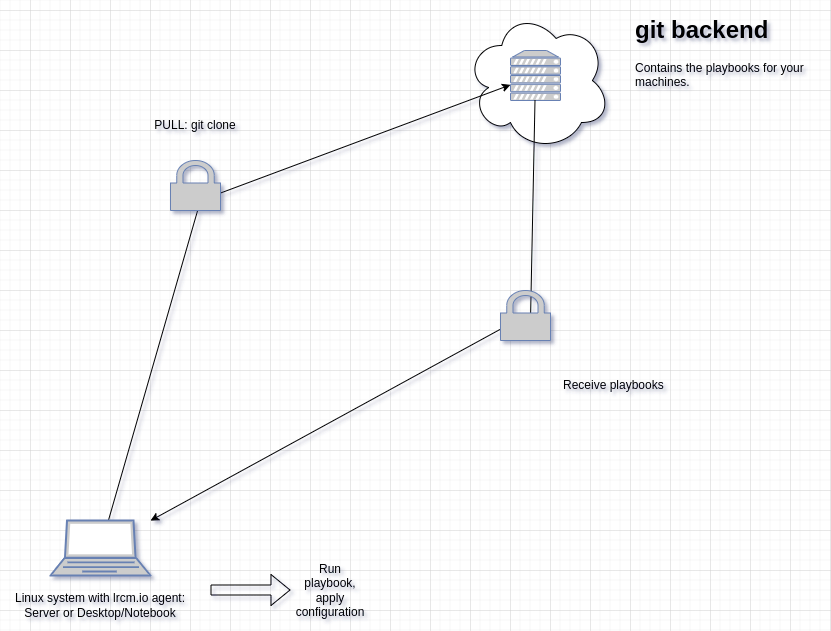

# linux-remote-configuration-management: lrcm



## use-case

The main use-case is managing Linux clients without having any management infrastructure and/or network access to the client devices, e.g. at (remote) schools, universities, IoT-devices, in science, unattended terminals, marketing displays, sensors etc.

## main goal

At first we had the need to implement a remote configuration management for some Linux clients

- somewhere in the world
- not accessible remote
- not always online
- using a secure way
- in a reproducable way
- standardized
- very small memory and cpu footprint (currently below 35 MB)

We had a first client - a bash-script - running for two years doing all the things we need, but the need for more features brought us here.

## what you get

You get an agent for Linux with a configured dummy backend.

## what you can do

You can change the configuration to use your own git instance and develop your own playbooks, roles, etc. You can also use Github or another git-compatible platform as backend. Maybe our commercial offer - a very secure Gitlab instance - is also interesting for you. We're also offering our engineers to develop the playbooks you need for configuration management.

## How it works

lrcm is - more or less - a simple python script. You can execute it manually or scheduled by cron (or whatever). The script clones a git repository which contains the playbook to run on your computer(s).

## configuration

Just have a look at the sample configuration file `lrcm.conf`

## host-specific tasks

You can add a host-specific playbook to your repository; the naming convention is 

`<hostname>-<playbook-name>`

that means if your hostname for example is `dirtydesktop69` and your playbook-name (section `[GIT]`/`playbook:` in the config file) is `playbook.yaml` you just have to add a playbook file called `dirtydesktop69-playbook.yaml` to your repository and it will be applied to the host called `dirtydesktop69` after the standard playbook was applied. 

## Python3 version compatibility

Currently this software is developed and tested on for Python

- 3.10.12
- 3.11.2
- 3.12.0

and may work with other Python versions.

## Linux distribution and version compatibility

Currently this software is developed and tested on and for Debian Linux 12.

It also works on Linux Mint 21.3 (because that's currently my favorite Linux Desktop distribution) and also on Fedora Linux 39, but not tested regularly.

and may work on other Linux distributions. We plan to support Debian 11, Debian 12, Ubuntu 22.04, 24.04, Fedora 39, Rocky 9 and openSuSE.

## system requirements

### client preparation

#### Debian 12

```
apt-get update && apt-get -y install python3 python3-git python3-ansible-runner python3-validators python3-psutil python3-distro cron && systemctl enable cron && systemctl restart cron
```

#### Fedora 39

```
dnf -y install python3-GitPython python3-ansible-runner python3-psutil ansible python3-validators cronie && systemctl enable crond && systemctl restart crond
```

#### Linux Mint 21.3

```
apt-get update && apt-get -y install python3 python3-git python3-ansible-runner python3-validators python3-psutil python3-distro cron && systemctl enable cron && systemctl restart cron
```

You can find some Ansible playbooks for preparing clients in directory `/client-setup`.

## testing

### test with demo-repo

```
cd /opt/ && git clone https://github.com/72itde/linux-remote-configuration-management.git --branch main && 
cd linux-remote-configuration-management/ && ./lrcm.py --configfile=lrcm.conf.demo --debug --cronjobs=False
```

## installation

## Roadmap

### May 2024: First stable version

### Juli 2024: Build Packages for all supported Linux distributions

### September 2024: Add a ping/"I'm still alive"-service

### December 2024: Add a secure remote logging solution 

## commercial support

If you're interested in commercial support please contact us via <https://www.72it.de/>