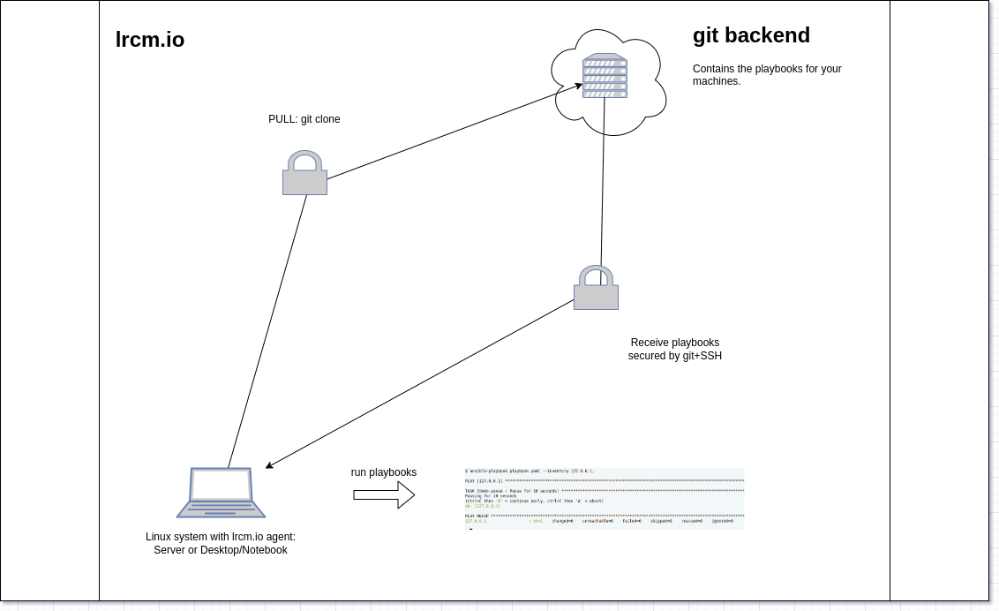

# linux-remote-configuration-management: lrcm.io



## use-case

The main use-case is managing Linux clients without having any management infrastructure and/or network access to the client devices.

## main goal

At first we had the need to implement a remote configuration management for some Linux clients
- somewhere in the world
- not accessible remote
- not always online
- using a secure way
- in a reproducable way
- standardized

We had a first client - a bash-script - running for two years doing all the things we need, but the need for more features brought us here.

## what you get

You get an agent for Linux distribution in a fully working manner with a configured dummy backend.

## what you can do

You can change the configuration to use your own git instance and develop your own playbooks, roles, etc. You can also use Github or another git-compatible platform as backend. Maybe our commercial offer - a very secure Gitlab instance - is also interesting for you. We're also offering our engineers to develop the playbooks you need for configuration management.

## Python3 version compatibility

- 3.10.12
- 3.11.2

## distribution compatibility

Currently this software is developed and tested on and for

- Debian Linux 12
- Fedora Linux 39
- Linux Mint 21.3

and may work on other Linux distributions.

## installation

#### Debian 12

```
apt-get update && apt-get -y install python3 python3-git python3-ansible-runner python3-validators python3-psutil python3-distro cron && systemctl enable cron && systemctl restart cron
```

#### Fedora 39

```
dnf -y install python3-GitPython python3-ansible-runner python3-psutil ansible python3-validators cronie && systemctl enable crond && systemctl restart crond
```

#### Linux Mint 21.3

```

```


## testing

### test with demo-repo

```
cd /opt/ && git clone https://github.com/72itde/linux-remote-configuration-management.git --branch initial-dev && 
cd linux-remote-configuration-management/ && ./lrcm.io.py --configfile=lrcm.io.conf --debug --cronjobs=False
```
