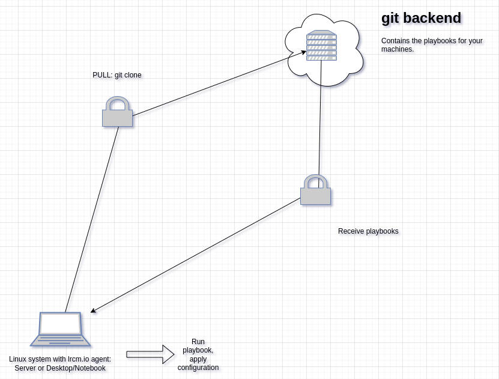

# linux-remote-configuration-management: lrcm

[](https://github.com/72itde/linux-remote-configuration-management/actions/workflows/ci.yml)



## use-case

The main use-case is managing Linux clients without having any management
infrastructure and/or network access to the client devices, e.g. at (remote)
schools, universities, IoT-devices, in science, unattended terminals, marketing
displays, sensors etc.

## main goal

At first we had the need to implement a remote configuration management for some
Linux clients

- somewhere in the world
- not accessible remote
- not always online
- using a secure way
- in a reproducable way
- standardized
- very small memory and cpu footprint (currently below 35 MB)

We had a first client - a bash-script - running for two years doing all the
things we need, but the need for more features brought us here.

## what you get

You get an agent for Linux with a configured dummy backend.

## what you can do

You can change the configuration to use your own git instance and develop your
own playbooks, roles, etc. You can also use Github or another git-compatible
platform as backend. Maybe our commercial offer - a very secure Gitlab instance
- is also interesting for you. We're also offering our engineers to develop the
playbooks you need for configuration management.

## how it works

lrcm is a single python script. You can execute it manually or scheduled by cron
(or whatever). On every run it

1. checks that the distribution and the python version are supported,
2. takes an advisory lock so two runs can never overlap,
3. waits a fixed plus a random delay, so a whole fleet does not hit the git
   server in the same second,
4. shallow-clones the configured branch of your playbook repository into a
   temporary directory,
5. applies `playbook.yaml`, then `<hostname>-playbook.yaml` if it exists,
6. creates or removes its own `/etc/cron.d/lrcm_*` entries, and
7. deletes the temporary directory and releases the lock - also when something
   went wrong.

## installation

### Debian 12, Debian 13, Ubuntu 24.04 LTS, Ubuntu 26.04 LTS, elementary OS 8

Download the `.deb` from [releases](https://github.com/72itde/linux-remote-configuration-management/releases)
and install it:

```sh
sudo apt-get install ./lrcm_<version>_all.deb
```

The package pulls in every dependency, installs the agent to `/opt/lrcm/`, adds
a `/usr/bin/lrcm` entry point and creates `/etc/lrcm/lrcm.conf` from the shipped
template on first install. Your configuration is never overwritten by an
upgrade.

### Fedora, Linux Mint, LMDE

No packages available yet, so use `git clone` and install the dependencies with
the playbooks in [client-setup/](client-setup/).

## configuration

The configuration lives in `/etc/lrcm/lrcm.conf`; see
[lrcm.conf.template](lrcm.conf.template) for a commented example.

| section | option | default | meaning |
| --- | --- | --- | --- |
| `GENERAL` | `delay_before_start_seconds` | `60` | fixed delay before lrcm starts working |
| `GENERAL` | `delay_before_start_random_max_seconds` | `60` | additional random delay of 0..n seconds; `0` disables it |
| `GENERAL` | `timeout_seconds` | `3600` | upper bound for one git transfer and one playbook run |
| `GIT` | `repository` | *required* | url of the playbook repository (`https`, `http`, `ssh`, `git` or `file`) |
| `GIT` | `branch` | `main` | branch to clone |
| `GIT` | `playbook` | `playbook.yaml` | playbook to apply, relative to the repository root |
| `GIT` | `authentication_required` | `false` | use `username`/`token` (https only) |
| `GIT` | `username` | - | git username |
| `GIT` | `token` | - | git token |
| `CRONJOB` | `hourly_cronjob` | `false` | keep `/etc/cron.d/lrcm_hourly` |
| `CRONJOB` | `daily_cronjob` | `false` | keep `/etc/cron.d/lrcm_daily` |
| `CRONJOB` | `reboot_cronjob` | `false` | keep `/etc/cron.d/lrcm_reboot` |
| `PIDFILE` | `pidfile` | `/run/lrcm.pid` | lock file that serialises lrcm runs |

Cron entries set to `false` are actively removed, so switching one off here
uninstalls it on the next run.

## command line

```
lrcm [-c PATH] [-d] [-v] [-j BOOL | --no-cronjobs] [--no-delay] [--syslog]
```

| option | meaning |
| --- | --- |
| `-c`, `--configfile PATH` | configuration file (default `/etc/lrcm/lrcm.conf`) |
| `-v`, `--verbose` | log progress information |
| `-d`, `--debug` | log everything, including ansible output |
| `-j`, `--cronjobs BOOL` | manage the cron entries (default `true`) |
| `--no-cronjobs` | same as `--cronjobs=false` |
| `--no-delay` | skip the configured start delay, for interactive runs |
| `--syslog` | additionally send log records to syslog |
| `--version` | print the version and exit |

Without `-v` or `-d` lrcm only reports warnings and errors, so a cron run stays
silent unless something needs attention.

Exit codes: `0` success (also when another instance holds the lock), `1`
configuration or environment error, `2` a step failed while working.

## host-specific tasks

You can add a host-specific playbook to your repository; the naming convention
is

`<hostname>-<playbook-name>`

that means if your hostname for example is `dirtydesktop69` and your
playbook-name (section `[GIT]`/`playbook:` in the config file) is
`playbook.yaml` you just have to add a playbook file called
`dirtydesktop69-playbook.yaml` to your repository and it will be applied to the
host called `dirtydesktop69` after the standard playbook was applied.

## token handling

When `authentication_required` is set, the token is handed to git through
`GIT_ASKPASS` instead of being embedded in the repository url. It therefore
never appears

- in the process list (`/proc/<pid>/cmdline` is world readable),
- in the cloned repository's `.git/config`, or
- in lrcm's log output, including git's own error messages.

`/etc/lrcm` is `0700 root:root` and `/etc/lrcm/lrcm.conf` is `0600 root:root`;
the package re-applies both on every upgrade.

## compatibility

### Linux distributions

Support is matched on the distribution id and the `major.minor` version, so
every point release of a supported version works - `24.04`, `24.04.1` and
`24.04.7` alike.

| distribution | tested |
| --- | --- |
| Debian GNU/Linux 12 (bookworm) | yes, in CI |
| Debian GNU/Linux 13 (trixie) | yes, in CI |
| Ubuntu 24.04 LTS (noble numbat), all point releases | yes, in CI |
| Ubuntu 26.04 LTS (resolute raccoon), all point releases | yes, in CI |
| elementary OS 8 (circe) | supported, not in CI |
| Linux Mint 21.3 | supported, not in CI |
| LMDE 6 (faye), LMDE 7 (gigi) | supported, not in CI |
| Fedora Linux 39 | supported, not in CI |

Running on an unlisted distribution is refused with exit code 1.

### Python

lrcm requires Python 3.10 or newer. These versions are explicitly tested:

- 3.10.12 (Linux Mint 21.3)
- 3.11.2 (Debian 12, LMDE 6)
- 3.12.0
- 3.12.3 (Ubuntu 24.04, elementary OS 8)
- 3.13.5 (Debian 13, LMDE 7)
- 3.14.0 (Ubuntu 26.04)

Any other 3.10+ version runs but logs a warning, so a distribution point release
that bumps the patch level no longer takes a whole fleet down.

## system requirements

### client preparation

Only needed when you install from git instead of the `.deb`. On Debian, Ubuntu,
Linux Mint, LMDE and elementary OS:

```sh
sudo apt-get update && sudo apt-get -y install \
  python3 python3-git python3-ansible-runner python3-jinja2 \
  python3-validators python3-distro git cron
sudo systemctl enable --now cron
```

There are Ansible playbooks for the same job in [client-setup/](client-setup/).

## testing

### test with the demo repository

```sh
cd /opt/ && sudo git clone https://github.com/72itde/linux-remote-configuration-management.git --branch main
cd linux-remote-configuration-management/
sudo ./lrcm.py --configfile=lrcm.conf.template --debug --no-cronjobs --no-delay
```

### development

```sh
python3 -m venv .venv && . .venv/bin/activate
pip install -r requirements.txt -r requirements-dev.txt

ruff check . && ruff format --check .   # style
mypy                                    # types
pytest                                  # unit tests
ansible-lint --profile production       # ansible content
./tests/check-version-consistency.sh    # VERSION == lrcm.py == CHANGELOG.md
```

### building the package

```sh
./packaging/debian/build-deb.sh          # writes dist/lrcm_<version>_all.deb
```

The staging tree is assembled from scratch in a temporary directory, so no
repository file can leak into the package.

## releasing

1. bump `VERSION` and `__version__` in `lrcm.py`, add a `CHANGELOG.md` section,
2. merge to `main`,
3. push a tag `v<version>`.

The [release workflow](.github/workflows/release.yml) verifies that tag,
`VERSION`, `lrcm.py` and `CHANGELOG.md` agree, builds the `.deb`, generates
`SHA256SUMS` and publishes a GitHub release with the changelog section as
release notes.

## token creation

### Gitlab

A token in Gitlab must have an expiration date that could lead to problems; you
can extend the token by using SQL in the Gitlab database. Use role **Reporter**
and check **read_repository**

## upgrading from 0.7.x

The configuration file format is unchanged and existing cron entries keep
working. Three things changed:

- lrcm is quiet by default. Add `-v` to the cron job to get the old `INFO`
  output, or `--syslog` to send it to the journal.
- A failing playbook is now reported: lrcm exits `2` instead of `0`. Cron will
  mail you about failures that previously went unnoticed.
- `python3-psutil` is no longer needed; the pidfile is now a real advisory lock.

## roadmap

- remote logging
- remote status dashboard
- code signing/verification

## license

[MIT](LICENSE)

## commercial support

If you're interested in commercial support please contact us via
<https://www.72it.de/>
